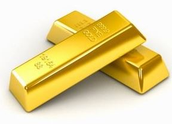
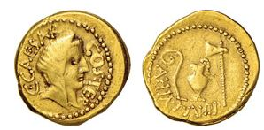
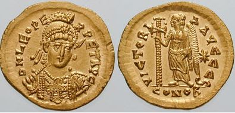
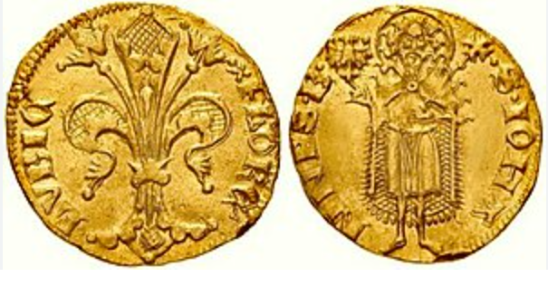

## Perchè l'oro
Abbiamo visto nell'articolo precedente l'uso dei metalli come bene denaro. 

  Nella storia dell’umanità, il metallo denaro per eccellenza è stato l’oro che, ancora oggi, mantiene il ruolo di riserva di valore per tre motivi fondamentali:

1. È praticamente indistruttibile.
2. È impossibile da sintetizzare a partire da altri elementi.
3. È scarso in natura; l'offerta non aumenta con l’aumento della domanda.

***Solo un bene con queste caratteristiche, potrà premiare coloro che la scelgono arricchendoli nel lungo periodo.***

### L'oro della republica di Roma

La Repubblica Romana di Giulio Cesare utilizzava l’aureus come moneta di scambio, contenente un valore fisso di 8 gr d'oro. Questa moneta, ampiamente accettata in Europa e nel Mediterraneo, stimolò i commerci, favorì la specializzazione e portò stabilità economica per 75 anni.

Nel frattempo la conquista di nuove terre portava ricchezza nelle casse della republica, ricchezza che gli imperatori utilizzavano per acquisire popolarità e mantenere eserciti sempre più costosi.
La popolazione rurale si trasferi nelle città dove la vita era migliore, lasciando le campagne incolte. Aumentava cosi il numero di persone improduttive che, per vivere, faceva affidamento sulla benevolenza dell'imperatore.  Le attività produttive venivano lasciate alle popolazioni conquistate e sottomesse ***Globalizzazione dell'antica Roma*** 
Quando però le terre da conquistare si esaurirono la republica si ritrovò a gestire un sistema molto oneroso e una popolazione improduttiva.

Nerone  trovò il modo per "risolvere" i problemi finanziari dell'impero anticipando le teorie economiche di Johm Maynard Keynis: trasformò  l'abitudine romana della **limatura delle monete** in attività istituzionale.  
Le monete venivano sottratte alla popolazione e se ne coniavano di nuove con minor contenuto d’oro.  

Il contenuto d'oro dell’aureus venne cosi ridotto da 8 a 7,2 gr.  

Questa pratica di svalutazione della moneta continuò sotto il regno di Caracalla riducendo il contenuto d'oro a 6,5 gr e con Diocleziano scese ulteriormente a 5,5. L'aureus venne poi sostituito da una nuova moneta, **il solido** contenente solo 4,5 gr di oro. 

***Le conseguenze furono devastanti: l'aumento della moneta in circolazione permetteva agli imperatori di aumentare le spese, ma svalutava la moneta aumentando il costo della vita.
Il popolo, privato dalle proprie ricchezze e impoverito dall' aumento dei prezzi, si rifugio nelle campagne diventando di fatto contadini autosufficenti destinati a diventare i futuri servi dei signori feudali.
IL declino monetario porta con se quello fiscale, militare, culturale e spirituale.***

**Nerone fu il precursore della teoria Keynesiana adottata da America e Gran Bretagna dopo la prima guerra mondiale.**

Nel 312 D.C., l'imperatore Costantino il Grande, iniziò a coniare grandi quantità di solido, si impegnò a mantenere il suo valore invariato e trasferi la capitale a Costantinolpoli.
Roma decadde nel 476 D.C. mentre l'impero romano d'Occidente prosperò fino al 1453, quando fu conquistato dell'impero Ottomano. 
Il solido prese il nome di Bisante a seguire dinaro islamico e fu una delle monete più riconosciute e accettate al mondo. 
Il motivo è molto semplice: mantenere invariata la quantità d'oro a 4,5gr lo rese bene monetario stabile capace di preservare la ricchezza accumulata e di trasferirla nel tempo. 
 
 ## Il periodo buio del Feudalesimo

 Il feudalesimo fu la principale forma di organizzazione sociale che segui la caduta dell'impero romano.
 L'oro si concentrò nelle mani di pochi signori feudali e agli ex cittadini dell'impero romano, impoveriti dalla svalutazione dell'aureus, rimasero solo monete di argento, rame o bronzo, metalli facilmente svalutabili. "denaro fiat".
 Il commercio, limitato dalla mancanza di un solido standard monetario trascinò la storia della civiltà nei secoli bui del medioevo.

 ## Il rinascimento
 

La rinascita di una società prospera fu sancita dalle città stato.
Nel 1252 a Firenze venne coniato Il fiorino, prima moneta d'oro europea,  che rese i fiorentini liberi di lavorare, produrre, commerciare e accumulare ricchezza. 
Alla fine del 1500 molte città e stati europei avevano seguito l'esempio di Firenze. 
*** Un solido standard monetario è requisito fondamentale per la prosperità di un popolo ***  

## Non è tutt'oro quello che luccica
Lo standard monetario di fatto divenne nella storia l'oro.

A onor di cronaca anche l'argento giocò un ruolo importante nella storia dell'umanità, ma con l'inesorabile progresso tecnologico, chi aveva accumulato ricchezza con l'argento subi perdite importanti. 
Il telegrafo nel 1837 e la rete ferroviaria, portarono ad un utilizzo sempre maggiopre di banconote sostituebdo di fatto le  monete di metallo più difficili da trasportare. 
In questo modo, oro e argento potevano essere lasciati in custodia alla banca e ricevere in cambio banconote di egual valore secondo lo standard monetario chiamato Gold Standard. 

*** le baconote risolvevano il problema della commerciabilità in scala delle monete metallo. ***
 
 L'oro veniva accumulato dalle banche sottraendolo alla sovranità individuale. 
 Il controllo centralizzato è il problema che vedremo nel prossimo articolo: Il denaro di stato 
 
 
*** non è possibile isolarsi dalle conseguenze economiche causate da chi detiene e utilizza forme di denaro sane, migliori. ***
