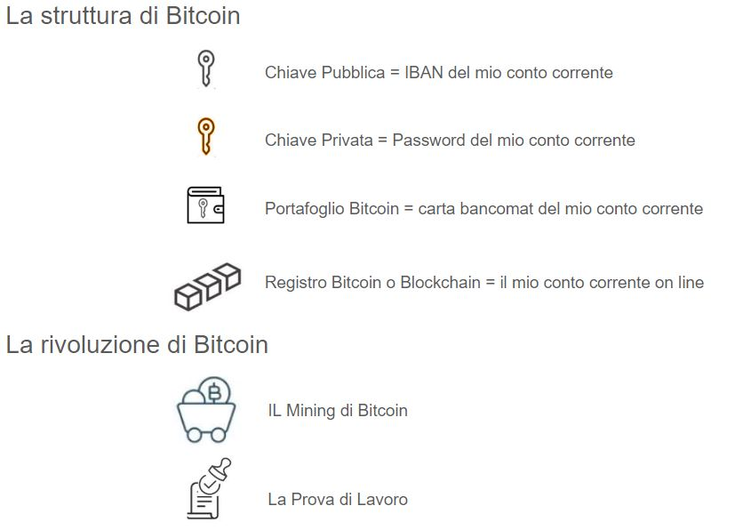

La banconota da 10 € che ho nel mio portafoglio è reale.

Quando spendo i miei 10 €, fisicamente cedo la banconota a un altra persona.Nessuno può mettere in dubbio che io possiedo quella banconota finchè si trova nelle mie mani, e nessuno può possederla senza il mio consenso.  Tutte le nostre banconote da 10 € creano un sistema finanziario decentralizzato dove ognuno può decidere cosa fare della propria banconota e nessuno è a conoscenza di quante banconote possiedono gli altri e come le utilizzano.

La banconota da 10 € che ho nel mio conto corrente bancario è virtuale.

La mia banca salva nel proprio server centrale tutte le informazioni che riceve quando utilizzo la mia carta bancomat e aggiorna di conseguenza il saldo del mio conto. La mia carta bancomat non contiene i 10 €, ma contiene le chiavi di accesso al mio conto che mi permettono di spostare virtualmente i miei 10 €.  La banca centralizza il controllo dei miei 10 €, quantifica quante banconote da 10 € possiedo e, per certi aspetti, regola il possesso delle mie banconote.
La banca centralizzata è custode delle mie informazioni finanziarie. 

Il bitcoin o satoshi che ho nel mio conto Bitcoin è digitale.
Il portafoglio Bitcoin è come la mia carta bancomat ma non dipende da una banca e non fornisce alcuna informazione a un sistema centralizzato. Le informazioni sono pubbliche all'interno della rete Bitcoin. La mia identità non è pubblica.
Il mio portafoglio Bitcoin ha le chiavi che mi permettono di utilizzare i miei bitcoin. Nessuno può mettere in dubbio che io possiedo quei bitcoin finchè possiedo le chiavi e nessuno può possederli se non conosce le chiavi o senza il mio consenso. Il sistema Bitcoin utilizza la moneta bitcoin che unisce i vantaggi della moneta fisica alle forme di pagamento digitali ed è la  naturale evoluzione finanziaria che dal baratto passa per la moneta metallo, la banconota di carta e la banconota digitale.

Il sistema Bitcoin è un protocollo, un insieme di regole che ci permettono di scambiare bitcoin all'interno della rete internet. 
Per capire il termine protocollo, pensiamo alle mail che  usiamo quotidianamnete: senza le regole scritte dei protocolli SMTP-POP3 o IMAP non potremmo scambiarci mail. Servono delle regole distribuite e accettate dalla rete.

Cerchiamo di riassumere le regole del protocollo Bitcoin con uno schema. 

