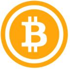

Chi, per la prima volta, sente parlare di bitcoin pensa a bitcoin come a valuta digitale, pensata e utilizzata dal mondo informatico e dal sistema finanziario tradizionale a puro scopo speculativo. 

Difficile paragonare bitcoin alla moneta da 1 € che utilizziamo per pagare un caffè al bar o alla moneta virtuale che utilizziamo per fare la spesa con la nostra carta bancomat, un mezzo comodo che la tecnologia ci offre per  spostare soldi che noi immaginiamo reali.

Nella realtà, Bitcoin svolge la stessa funzione del nostro € ma in un sistema diverso dal sistema che conosciamo.  **Il sistema Bitcoin è una raccolta di concetti e tecnologie capaci di creare un sistema  finanziario decentralizzato che scambia valore utilizzando una moneta digitale chiamata bitcoin**. Per convenienza chiameremo Bitcoin con la B maiuscola il sistema, bitcoin con la b minuscola la moneta che, nelle sue unità piu piccole, viene chiamata anche Satoshi o sat. 
Tutti possono liberamente partecipare al sistema Bitcoin, per farlo bisogna conoscerlo. Nei prossimi capitoli cercheremo di spiegarvi i concetti alla base del sistema Bitcoin. 
*** Non è possibile isolarsi dalle conseguenze economiche causate da chi detiene e utilizza forme di denaro sane, migliori. ***

